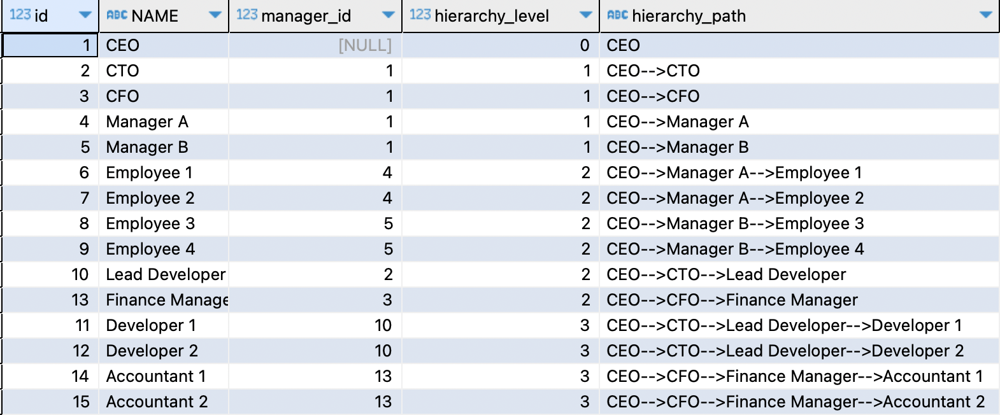

## Objective
CONNECT BY is used in Oracle for hierarchical data. However this is not available in Mysql and so, here we will use recursive CTE to query hierarchical data.


## Data preparation

```sql
drop table demo.employees;
CREATE TABLE demo.employees (
    id INT PRIMARY KEY,
    name VARCHAR(255),
    manager_id INT
);
INSERT INTO employees (id, name, manager_id) VALUES (1, 'CEO', NULL),
(2, 'CTO', 1),
(3, 'CFO', 1),
(4, 'Manager A', 1),
(5, 'Manager B', 1),
(6, 'Employee 1', 4),
(7, 'Employee 2', 4),
(8, 'Employee 3', 5),
(9, 'Employee 4', 5),
(10, 'Lead Developer', 2),
(11, 'Developer 1', 10),
(12, 'Developer 2', 10),
(13, 'Finance Manager', 3),
(14, 'Accountant 1', 13),
(15, 'Accountant 2', 13);
```

## Solution

```sql
WITH recursive employeehierarchy AS
(
       SELECT id,
              NAME,
              manager_id,
              0 AS hierarchy_level,
              name as hierarchy_path
       FROM   demo.employees
       WHERE  manager_id IS NULL -- Start with top-level managers
       UNION ALL
       SELECT e.id,
              e.NAME,
              e.manager_id,
              eh.hierarchy_level + 1,
              CONCAT(hierarchy_path, '-->', e.name) as hierarchy_path
       FROM   demo.employees e
       JOIN   employeehierarchy eh
       ON     e.manager_id = eh.id )
SELECT   id,
         NAME,
         manager_id,
         hierarchy_level,
         hierarchy_path
FROM     employeehierarchy
ORDER BY hierarchy_level,
         id;
```

## Output

