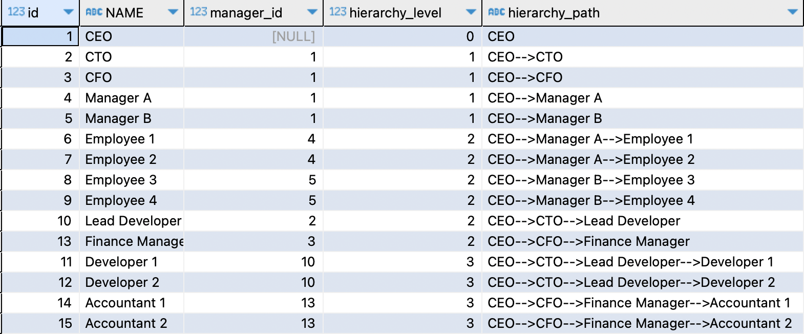

# Hierarchical Query in MySQL (CONNECT BY equivalent) - Solutions

## Solution 1: Recursive CTE

Oracle's `CONNECT BY PRIOR` walks a self-referencing hierarchy from a root row downward.
MySQL has no such clause, but a recursive CTE does the same job: the anchor member picks
the root (`manager_id IS NULL`), and the recursive member repeatedly joins each employee
to the manager already found in the hierarchy so far, incrementing `hierarchy_level` and
extending `hierarchy_path` one name at a time.

#### MySQL

```sql
WITH RECURSIVE employee_hierarchy AS (
    SELECT
        id,
        name,
        manager_id,
        0 AS hierarchy_level,
        name AS hierarchy_path
    FROM employees
    WHERE manager_id IS NULL
    UNION ALL
    SELECT
        e.id,
        e.name,
        e.manager_id,
        eh.hierarchy_level + 1,
        CONCAT(eh.hierarchy_path, '-->', e.name) AS hierarchy_path
    FROM employees e
    JOIN employee_hierarchy eh ON e.manager_id = eh.id
)
SELECT id, name, manager_id, hierarchy_level, hierarchy_path
FROM employee_hierarchy
ORDER BY hierarchy_level, id;
```

## Output


