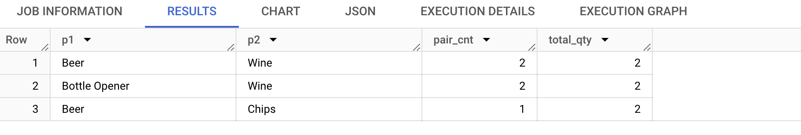

# Paired Products (Frequently Bought Together) - Solutions

## Solution 1: Self-join on `transaction_id`, then rank pairs

Self-join `transactions` to itself on `transaction_id`, keeping only `t1.product_id <
t2.product_id` so each unordered pair of products bought in the same transaction is
counted exactly once. Grouping by the pair gives, per pair, how many transactions
contained it (`pair_cnt`) and the summed quantity of the lower-id product across those
transactions (`total_qty`). Take the top 3 pairs by that ranking, then join back to
`products` to resolve names, ordering each pair's two names alphabetically into `p1`/`p2`.

#### MySQL

```sql
WITH cte AS (
    SELECT
        t1.product_id AS pid1,
        t2.product_id AS pid2,
        COUNT(*) AS pair_cnt,
        SUM(t1.quantity) AS total_qty
    FROM transactions t1
    JOIN transactions t2
        ON t1.transaction_id = t2.transaction_id
       AND t1.product_id < t2.product_id
    GROUP BY t1.product_id, t2.product_id
    ORDER BY pair_cnt DESC, total_qty DESC
    LIMIT 3
)
SELECT
    CASE WHEN prod1.name < prod2.name THEN prod1.name ELSE prod2.name END AS p1,
    CASE WHEN prod1.name < prod2.name THEN prod2.name ELSE prod1.name END AS p2,
    c.pair_cnt,
    c.total_qty
FROM cte c
JOIN products prod1 ON c.pid1 = prod1.id
JOIN products prod2 ON c.pid2 = prod2.id
ORDER BY c.pair_cnt DESC, c.total_qty DESC, p1, p2;
```

## Output


